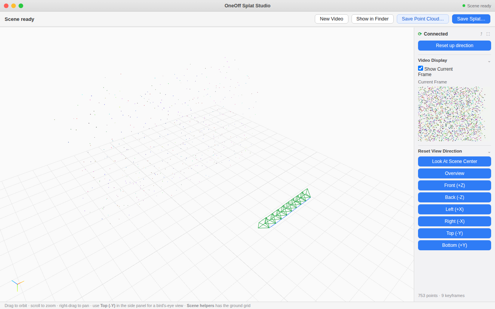

# OneOff Splat Studio

Ricostruzione 3D **in locale**: carichi un video (o una foto), guardi la scena
crescere nel viewer 3D mentre viene elaborata, e salvi il risultato come point
cloud o Gaussian splat.

Riproduzione dell'applicativo mostrato nel reel Instagram (Lingbot Studio),
con due motori di ricostruzione:

| Input | Motore | Note |
|---|---|---|
| **Video** | SfM incrementale (OpenCV) | zero dipendenze pesanti, niente GPU, in tempo reale |
| **Foto** | [Apple SHARP](https://github.com/apple/ml-sharp) | gaussiane fotorealistiche da una singola immagine; va installato a parte (vedi sotto) |



## Avvio

```bash
pip install -r requirements.txt
python -m splat_studio
```

Si apre il browser su `http://127.0.0.1:8765`. Trascina un video nel viewport
(o usa **New Video**) e la ricostruzione parte subito: i punti e le pose della
camera arrivano nel viewer in streaming via WebSocket mentre il video viene
ancora processato, all'incirca in tempo reale (dipende dalla CPU; la densità è
regolabile con `Config.densify_stride`).

## Motore SHARP per le foto (opzionale, consigliato)

[SHARP](https://github.com/apple/ml-sharp) di Apple genera gaussiane 3D
fotorealistiche da una **singola immagine**. Per abilitarlo (serve PyTorch;
al primo avvio scarica i pesi da Hugging Face):

```bash
pip install "git+https://github.com/apple/ml-sharp.git"
```

Fatto questo, trascina una foto (jpg/png/…) nell'app: viene processata con
SHARP e il risultato appare nel viewer già in qualità gaussiana. L'export
**Save Splat… → 3DGS (.ply)** restituisce l'output SHARP integrale (gaussiane
anisotrope + opacità), senza rielaborazioni.

Se il tuo binario SHARP ha un'interfaccia diversa, il comando è configurabile:

```bash
SHARP_CMD='sharp predict -i {input} -o {output_dir}' python -m splat_studio
```

qualunque strumento immagine→3DGS che scriva un `.ply` va bene.

## Render Mode: Points vs Gaussians

Nel pannello destro puoi scegliere come visualizzare la scena:

- **Points** — vista live durante l'elaborazione: dischi dimensionati sulla
  spaziatura locale, leggerissima;
- **Gaussians** — rendering 3DGS vero (splat ellittici ordinati e fusi con
  alpha blending) tramite
  [gaussian-splats-3d](https://github.com/mkkellogg/GaussianSplats3D) (MIT,
  vendorizzato). Si attiva da solo appena la scena è pronta.

## Cosa fa

- **Ricostruzione incrementale (SfM monoculare)** — `splat_studio/pipeline.py`
  - tracking dei corner con optical flow Lucas-Kanade piramidale
    (con verifica di consistenza forward-backward);
  - bootstrap della mappa con matrice essenziale + `recoverPose` tra i primi
    due keyframe;
  - localizzazione dei keyframe successivi con PnP RANSAC sui landmark già
    triangolati;
  - triangolazione di nuovi landmark tra keyframe consecutivi, con filtri su
    cheiralità, errore di riproiezione e parallasse;
  - **densificazione**: note le pose, tra ogni coppia di keyframe viene
    triangolata anche una griglia fitta di pixel con texture (uno ogni 3 px,
    fino a ~14k punti per keyframe) — è ciò che porta la nuvola a centinaia
    di migliaia di punti.
- **Viewer 3D live** — `frontend/` (Three.js, vendorizzato: funziona offline)
  - point cloud che cresce in tempo reale, scia dei frustum camera,
    griglia di terra, gizmo degli assi;
  - pannello laterale con frame corrente del video e preset di vista
    (Overview, Front/Back, Left/Right, Top/Bottom, Look At Scene Center,
    Reset up direction).
- **Export** — `splat_studio/export.py`
  - `pointcloud.ply` — point cloud colorata (binary PLY);
  - `scene_3dgs.ply` — formato 3D Gaussian Splatting standard (INRIA), apribile
    in SuperSplat, gsplat, ecc.;
  - `scene.splat` — formato antimatter15/splat.
  - Prima dell'export i punti passano da un filtro statistico di outlier (k-NN).

## Note sul metodo

La pipeline è geometria classica (OpenCV), non una rete neurale: per questo
gira ovunque senza download di modelli né GPU. Le gaussiane esportate sono
inizializzate dai punti triangolati (scala dalla spaziatura locale k-NN,
rotazione identità, colore come termine DC delle armoniche sferiche), non
ottimizzate per fotorealismo come in un training 3DGS completo.

Il video deve contenere **movimento di camera con parallasse** (una camminata,
un orbit attorno a un oggetto…): da un video statico o con sola rotazione non
si può triangolare struttura — in quel caso l'app lo segnala.

## Struttura

```
splat_studio/          backend Python
  pipeline.py          SfM incrementale (LK → essential/PnP → triangolazione + densify)
  sharp_engine.py      adapter CLI per Apple SHARP (foto → gaussiane)
  gsply.py             reader PLY 3DGS (output SHARP e affini)
  jobs.py              job manager + buffering per lo streaming WebSocket
  export.py            exporter PLY / 3DGS PLY / .splat
  server.py            FastAPI: upload, WebSocket, export
  __main__.py          entry point (python -m splat_studio)
frontend/              viewer (HTML/CSS/JS; vendorizzati: three.js, gaussian-splats-3d)
```
